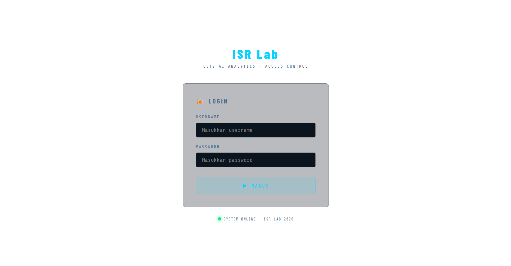
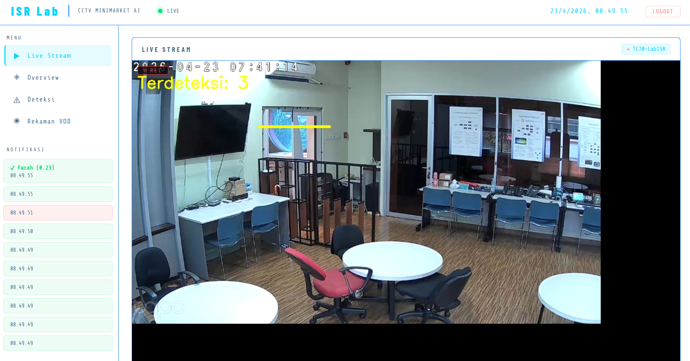

# 🖥️ Node.js Backend — Video Analytics AI

Real-time backend server & dashboard for AI-based video analytics system built on Edge Computing architecture.


---

## 🚀 Overview

This project is developed as part of an internship at **ISR Lab (Infrastructure Service and Research Laboratory), PT. Telkom Indonesia**, serving as the backend and dashboard layer for a real-time AI video analytics system running on Edge Computing architecture.

Instead of handling AI processing directly, this server **receives detection results** from a Python AI edge device (NVIDIA Jetson), stores them in a PostgreSQL database, and presents them on a real-time dashboard without page refresh.

This system can be applied to various environments that require CCTV-based AI surveillance, such as:
- 🏪 Minimarkets & Retail Stores
- 🏫 Schools & Universities
- 🏢 Office Buildings
- 🏭 Factories & Warehouses
- 🏥 Hospitals & Clinics
- 🅿️ Parking Areas
- 🏨 Hotels & Accommodations

---

## ✨ Features

| Feature | Description |
|---|---|
| 🔴 **Live Stream** | Displays processed MJPEG video stream from Python AI server |
| 👤 **Face Detection Logging** | Logs every detected face (Known, Unknown, Line Crossing) to database |
| ⚠️ **Anomaly Reporting** | Receives and stores anomaly reports from Python AI in real-time |
| 🚶 **Line Crossing Detection** | Detects and logs entry/exit events as security violations |
| 🎬 **Video Clip Proxy** | Serves 10-second anomaly clip videos from Jetson to browser securely |
| 📼 **VOD Recording** | Stores and serves 30-minute full recordings via Video on Demand |
| 📊 **Real-time Dashboard** | Live monitoring dashboard using WebSocket (Socket.io) |
| 🔔 **Toast Notification** | Instant anomaly alerts on dashboard without page refresh |
| 🔐 **Auth & Session** | User login system with bcrypt password hashing & persistent session |
| 🐳 **Docker Ready** | Fully containerized for easy deployment on edge devices |
| 🧹 **Auto Cleanup** | Scheduled automatic deletion of old recordings to manage storage |

---

## 🧱 Tech Stack

| Technology | Version | Purpose |
|---|---|---|
| Node.js | 18+ | Runtime environment |
| Express.js | 5.2.1 | Web server & REST API |
| PostgreSQL | 15-alpine | Database for detections & recordings |
| Socket.io | 4.8.3 | Real-time WebSocket communication |
| EJS | 4.0.1 | Server-side template engine for dashboard |
| Multer | 2.1.1 | Handles video file uploads from Python AI |
| bcrypt | 6.0.0 | Secure password hashing |
| connect-pg-simple | 10.0.0 | Persistent session storage in PostgreSQL |
| Docker | latest | Containerization for deployment |

---

## 🏗️ System Architecture

CCTV Camera (192.168.9.187)
│ RTSP
▼
Python AI Edge Device — NVIDIA Jetson (192.168.11.88)
├── Frigate         → Video Stream Management
├── YOLOv11         → Object & People Detection
├── InsightFace     → Face Recognition
├── Line Crossing   → Security Violation Detection
├── Flask Server    → MJPEG Stream + REST API
└── Frame Buffer    → Clip Recording
│ HTTP API
▼
Node.js Backend Server — Mini PC (192.168.11.63) [this repo]
├── REST API        → Receive detections from Python
├── PostgreSQL      → Store reports & recordings
├── Socket.io       → Push updates to dashboard
├── Video Proxy     → Bridge clip access from Jetson to browser
└── Dashboard UI    → Real-time monitoring (EJS)
│ Port 3000
▼
Browser Dashboard
---

## 🗄️ Database Schema

reports
├── id (PK)
├── event_type      → Terdeteksi / Anomali / Line Crossing
├── nama            → Detected person name or "Unknown"
├── confidence      → Detection confidence score
├── image_path      → Proxy URL of anomaly clip
├── status          → pending (default)
└── created_at
recordings
├── id (PK)
├── detection_id    → FK → reports.id
├── event_type
├── file_name
├── file_path       → URL to access video
├── duration_sec    → 10s (clip) or 1800s (VOD)
├── file_size_kb
├── synced          → Cloud sync status (future feature)
├── is_clip         → TRUE (anomaly clip) / FALSE (VOD)
└── created_at
---

## 📁 Project Structure

video-dashboard/
├── dashboard/
│   ├── login.png          # Dashboard screenshot
│   └── dashboard.png      # Dashboard screenshot
├── views/
│   ├── index.ejs          # Main dashboard page
│   └── login.ejs          # Login page
├── recordings/            # Video recordings folder (not tracked by Git)
├── storage/               # Local storage folder (not tracked by Git)
├── server.js              # Main server — Express, Socket.io, all API & routing
├── add-user.js            # Script to add new user to database
├── hash-password.js       # Script to hash user passwords
├── resetpw.js             # Script to reset user password
├── cleanup.sh             # Auto cleanup script for old recordings
├── docker-compose.yml     # Docker Compose configuration
├── Dockerfile.node        # Dockerfile for Node.js service
├── package.json           # Project dependencies
├── .env.example           # Environment variable template
└── .gitignore             # Files ignored by Git

---

## ⚙️ Installation

### 1. Clone the Repository
```bash
git clone https://github.com/saynaf1702-cyber/video-dashboard.git
cd video-dashboard
```

### 2. Install Dependencies
```bash
npm install
```

### 3. Setup Environment Variables
```bash
cp .env.example .env
nano .env
```

Fill in the values:
```env
# Database
DB_USER=postgres
DB_HOST=localhost
DB_DATABASE=video_analytics
DB_PASSWORD=your_password_here
DB_PORT=5432

# Server
PORT=3000
SERVER_IP=your_server_ip

# Security
SESSION_SECRET=your_secret_key_here

# Python AI Server
PYTHON_SERVER_URL=http://your_python_server_ip:5000
```

### 4. Create Login User
```bash
node add-user.js
```

### 5. Run the Server
```bash
# Development mode (auto-restart)
npx nodemon server.js

# Normal mode
node server.js
```

### 6. Access the Dashboard
http://your_server_ip:3000/dashboard

---

## 🐳 Docker Deployment

```bash
# Build and run all services
docker compose up -d

# Check container status
docker compose ps

# View logs
docker compose logs -f web

# Restart services
docker compose restart
```

---

## 🧹 Auto Cleanup

Automatic cleanup is scheduled daily at 02:00 AM via cron job:

| Data | Retention |
|---|---|
| VOD recordings (files) | 5 days |
| VOD recordings (database) | 5 days |
| Anomaly clips (database) | 30 days |
| Detection reports (database) | 7 days |

To setup:
```bash
chmod +x cleanup.sh
crontab -e
# Add: 0 2 * * * bash /path/to/cleanup.sh >> /path/to/cleanup.log 2>&1
```

---

## 🧠 How It Works

### Detection Flow

Python detects → POST /report-anomaly → Save to reports table → Socket.io emit → Dashboard updates
### Anomaly Clip Flow
Python creates clip → POST /notify-clip → Node.js creates proxy URL → Socket.io emit → Dashboard shows clip
### VOD Recording Flow
Python records 30min → POST /upload-video → Save .mp4 to /recordings → Save metadata to recordings table
### Live Stream Flow
Python Flask streams MJPEG → Browser accesses via Python URL → Displayed on dashboard

---

## 📡 API Endpoints

| Method | Endpoint | Description |
|---|---|---|
| POST | `/report-anomaly` | Receive detection report from Python AI |
| POST | `/upload-video` | Receive video file upload from Python AI |
| POST | `/notify-clip` | Receive clip-ready notification from Python AI |
| GET | `/proxy-clip?url=` | Proxy anomaly clip from Jetson to browser |
| GET | `/dashboard` | Main dashboard page |
| GET | `/api/health` | Server health check |
| PATCH | `/detections/:id/status` | Update detection status |
| DELETE | `/recordings/:id` | Delete a recording |

---

## 📸 Screenshots




---

## 🔗 Related Repository

This project works together with the **Python AI Edge Device** (separate repository) that handles:
- Real-time object & face detection (YOLO v11 + InsightFace)
- MJPEG live stream via Flask
- Clip recording & anomaly triggering
- Line crossing detection

---

## 👩‍💻 Author

**Sayyida Nafisa** — Node.js Backend & Dashboard Developer
Internship at ISR Lab, PT. Telkom Indonesia — 2026

---

## 📚 References
- [Node.js Documentation](https://nodejs.org/en/docs)
- [Express.js Documentation](https://expressjs.com)
- [Socket.io Documentation](https://socket.io/docs)
- [PostgreSQL Documentation](https://www.postgresql.org/docs)
- [Docker Documentation](https://docs.docker.com)